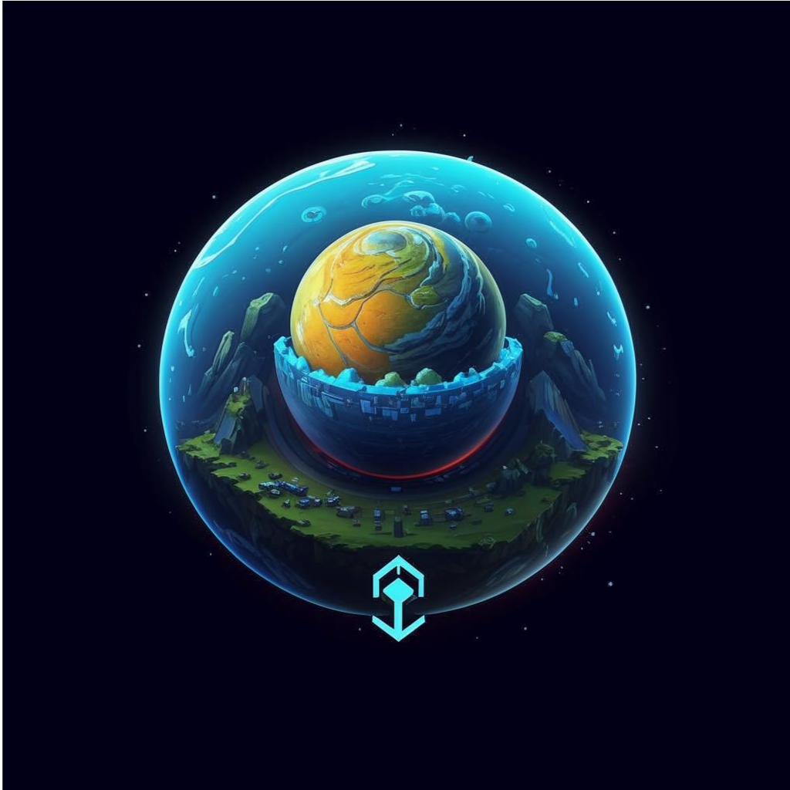

### SeyOS - multitasking operating system for x86/64 architecture

The desire to create an operating system arose in me quite a long time ago. As I gradually developed my programming skills, I realized how much interesting and exciting there is in this field. Inside me, the urge to rewrite everything from scratch emerged, so I could understand better how the modern world of technology works.

After learning how most software functions, I understood that this gives the opportunity to influence many aspects of our lives through technology. However, the goal of my project is not just that. I simply love programming! Yes, it’s one way to earn a living, but even if I weren’t making money through programming, I would still engage in it. I’m fascinated by the fundamental principles embedded in programming - it's a powerful tool that people can use for both good and ill.

Speaking of the diversity of software, I emphasize that it ultimately all comes together in the operating system. An operating system is a compilation of all the technologies that exist in IT.

I want to dedicate part of my free time to developing this wonderful project. Additionally, I plan to conduct live streams and record videos to share the process with those who are interested and to interact with them for mutual benefit.

SeyOS will be developed over several years. Yes, it’s an ambitious project. I want to create an OS with a graphical interface inspired by the user-friendliness of MacOS while combining it with the complete freedom of Linux. I aim to provide full control over the system through the terminal, while also offering similar capabilities through the graphical interface. My goal is to develop a fully open operating system with open-source code, documenting the development process through recorded videos.

Before fully embarking on this development, I want to implement a few interesting projects, such as a programming language and a library for creating GUIs. Most of this software will be written in C.

If you want to follow the development of these projects, go to my social networks:
- [Telegram](https://t.me/seyranchannel)
- [YouTube](https://www.youtube.com/@seyran_official_channel)

